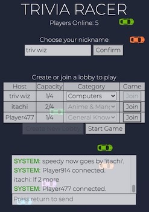

# Trivia Racer 🏁

Racing-themed broswer game featuring real-time multiplayer and chat<br>



Test your knowledge with thousands of questions across 18 categories provided by [Open Trivia Database API](https://opentdb.com/api_config.php)<br>
Play now at http://triviaracer.me or https://triviaracer.herokuapp.com!

## Installation
**Node.js 10+ required**

Use the package manager [npm](https://www.npmjs.com) to install the following dependencies: 

```bash
npm install express
```
```bash
npm install socket.io
```
```bash
npm install node-fetch
```

## Contributing
Pull requests are welcome. For major changes, please open an issue first to discuss what you would like to change.

## License
[MIT](https://choosealicense.com/licenses/mit/)

## Additional Information
Languages and technologies used:
  - Node.js
  - TypeScript
  - Express
  - Socket.io
  - jQuery
  - Bootstrap
  - Sass
  - Open Trivia Database API
  - Heroku
  - Custom Domain (triviaracer.me)
  - SSL Certified
